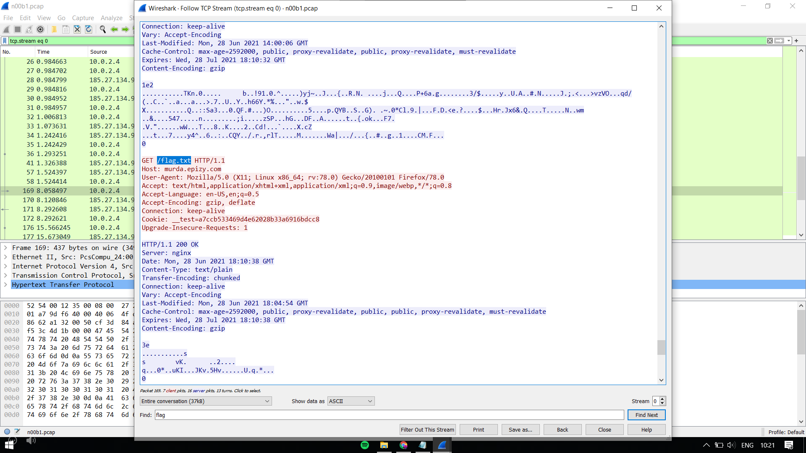
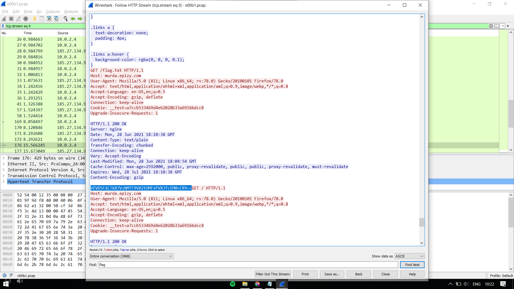

Hint: Find the hacker's flag from the network traffic

We have a packet capture that I opened up in Wireshark. On following the TCP stream, I see the domain murda.epizy.com  
There are multiple requests to the website. The one of our interest is the one to /flag.txt

So I followed the HTTP stream and try to find the response to the /flag.txt request.

This is what I got: VEVDSFdLTkR7VzNMTF9VX2tOMFdfVXJfcEM0cCR9== (a base64 encoded string)

Decoding it, we get,

TECHWKND{W3LL_U_kN0W_Ur_pC4p$}