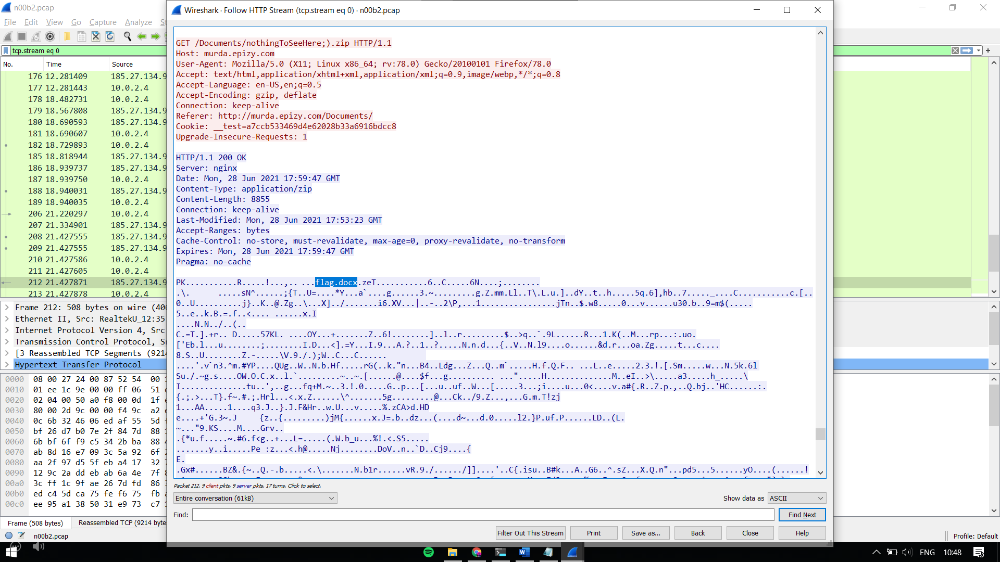
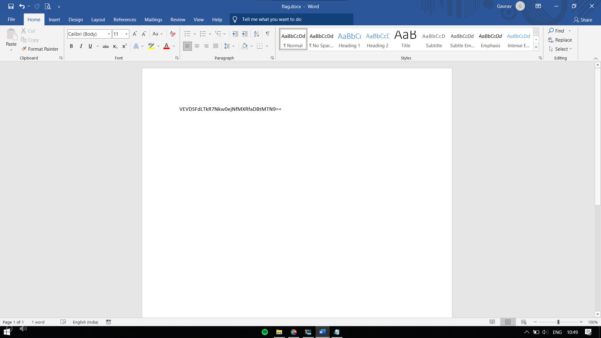

HINT: Well the hacker has taken a few extra steps to hide his tracks this time. Find the flag from the network traffic.

This time, the flag is not in /flag.txt
On browsing through the HTTP stream, we see at the end, a GET request to /Documents/nothingToSeeHere;).zip
The response is a lot of gibberish with flag.docx written in it. 
Seems like a zip file with the flag.

I opened up my browser and entered `murda.epizy.com/Documents/nothingToSeeHere;).zip`.
I was prompted to download the zip file. I extracted the document file in it, to get the flag in Base64 format.

Flag: TECHWKND{6L4z3_1t_h0m13}