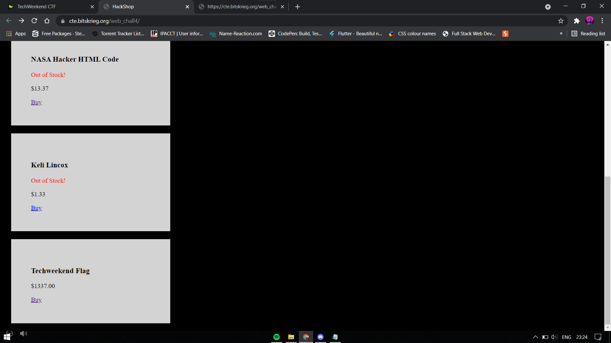

Hint: I found a shady marketplace online where they sell all kinds of hacker stuff. I heard you can buy a flag there as well. Do you have the money to afford it?

Challenge Link : https://cte.bitskrieg.org/web_chall4/

On clicking buy, it redirected me to:
https://cte.bitskrieg.org/web_chall4/buy?name=flag&price=Y29zdD0kMTMzNy4wMA==
with the page saying "ERROR: Insufficient funds"

The URL has a base64 encoded value for the price query string key.
Decoding it, we get: cost=$1337.00

So we encode the text `cost=$0.00` in B64 => Y29zdD0kMC4wMA==
We send a GET request to https://cte.bitskrieg.org/web_chall4/buy?name=flag&price=Y29zdD0kMC4wMA==

Response: Here you go: TECHWKND{m1Cr0tr4N5aCtIoN5_ftW}