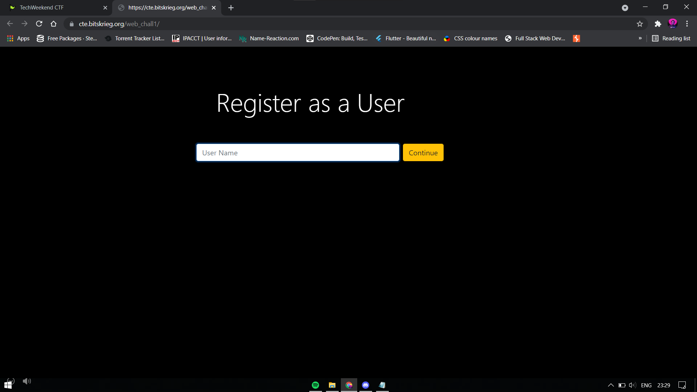

HINT: James hid an encrypted flag in one of his biscuits, and it's upto you to find the right one.

Tried to register as User.
Response: "Welcome user
You need Admin previliges to get the key."

On opening up the Chrome Inspect Tool and going to the Cookie Manager, we see there are 2 cookies (of our interest), called User(set to user) and ADMIN(set to false).
On setting ADMIN to true and clicking on the Get Flag button on the website, we get the flag VEVDSFdLTkR7MV9MMFYzX0NPMEsxM1N9

This is Base64 encoded. Decoding it, we get
TECHWKND{1_L0V3_CO0K13S}