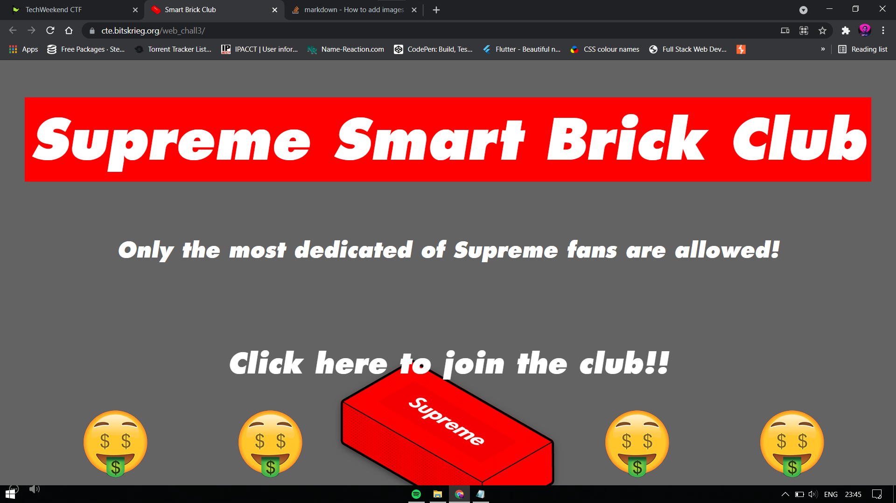
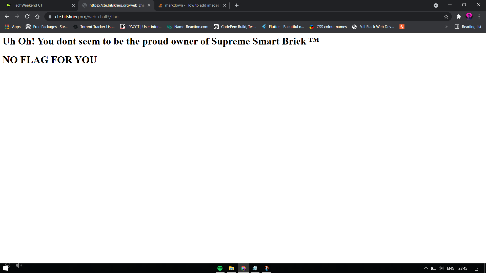

Hint: You won't believe it but the new Supreme Smart Brick ™ now has the ability to access web pages. Heard they are giving away prizes to those in the Supreme Smart Brick Club ™. See if youre eligible:
Challenge Link: https://cte.bitskrieg.org/web_chall3/

Click the button.

This is a problem about User-agent. In Chrome Inspector, go to Network Conditions Tab and set User-Agent as Supreme Smart Brick.
Refresh the page.

~~~~~~~~~~~~~~~~~~~~~~~~~~~~~
Welcome esteemed Supreme Smart Brick™ Owner
Here's your flag
TECHWKND{SUPR3M3_DR1P_S1NK5_SH1P5}