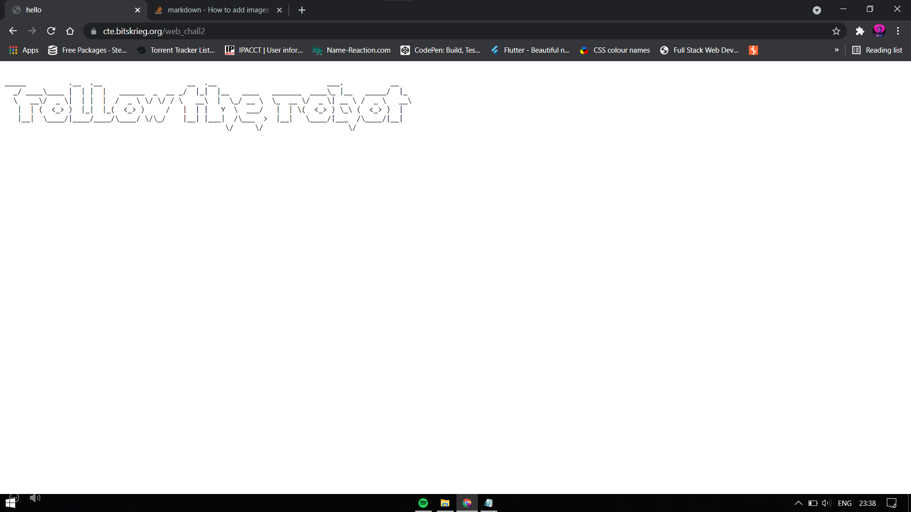
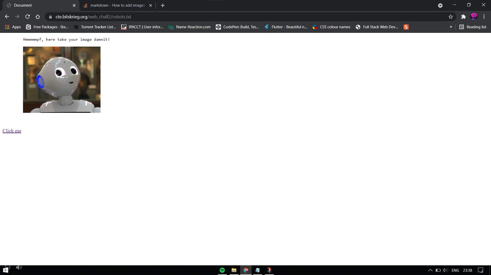

Hint : Dang, no one wants to use your reference
Website: https://cte.bitskrieg.org/web_chall2

HTML Referer header problem.

This is a hint for us to access the robots.txt file on the website.

The robots.txt page.

Inspecting the page source code, we see the comment `passphrase=""`
So, I downloaded the robot image and used steghide with empty passphrase, to get an output of 'https://www.google.com/'

https://cte.bitskrieg.org/web_chall2/flag 
This website says: You're only allowed to come from a particular website

So sending a GET request to the flag page with Referer header set to https://www.google.com/ gave me the flag. I used Postman for this.

THE flag is TECHWKND{fin411y_som3thin_1_c4n_r3f3r_t00}
